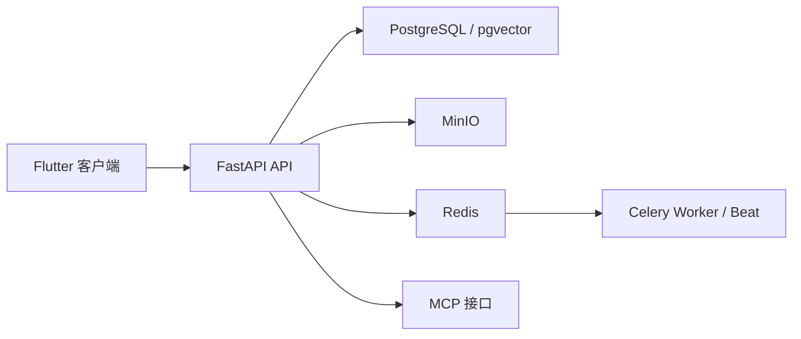

# Synora

面向个人场景的 AI 助理系统，提供多用户账号体系、对话式任务入口、日程解析、速记整理、提醒通知与 MCP 集成能力。


## 项目简介

Synora 是一个围绕“对话即入口”构建的助理型应用仓库，当前包含 Flutter 客户端、FastAPI 后端、后台任务调度与完整部署配置。它不再是早期的单用户原型，而是已经具备基础的多用户能力：用户可自行注册、登录、维护独立会话与个人偏好，系统按用户隔离管理对话、日程、速记、长期记忆、附件与通知记录。

当前仓库重点覆盖以下方向：

- 用聊天式交互统一承接任务描述，而不是拆分成多个表单页面。
- 支持文本、图片、PDF 等附件输入，为日程提取、速记整理和后续推理提供上下文。
- 将自然语言中的日程信息解析为结构化草稿，并进行冲突检测、审批确认、提醒创建与后续编辑。
- 将碎片化想法整理为速记，支持标签管理、回看与按标签筛选。
- 通过长期记忆、流式对话、工具调用审计和 MCP Server，为后续代理化能力扩展提供基础设施。

## 核心能力

- `多用户账号体系`：支持注册、登录、登出、会话恢复与用户级数据隔离。
- `对话式主入口`：围绕会话线程组织消息流，支持新建会话、重命名、删除、回退上一轮与编辑重发。
- `流式智能处理`：消息发送后可通过流式事件持续返回文本增量、工具状态与结构化结果卡片。
- `多模态输入`：支持文本、图片、PDF 等附件上传；Flutter 客户端首版支持本地语音输入。
- `日程工作流`：支持日程草稿生成、缺失字段补充、冲突检查、审批确认、提醒创建与后续编辑。
- `速记工作流`：支持速记预览、审批保存、标签聚合、标签筛选与内容编辑。
- `长期记忆`：按用户维护记忆记录与画像摘要，用于增强后续对话上下文。
- `提醒通知`：通过 Celery 调度邮件或企业微信机器人提醒，并保留完整通知审计。
- `MCP 集成`：提供带 Bearer Token 的标准 Streamable HTTP MCP 接口，便于外部 Agent 或工具系统接入。

## 系统架构

Synora 当前采用“客户端 + API + 异步任务 + 存储服务”的结构：

- `Flutter 客户端`：负责注册登录、对话界面、附件选择、日程/速记/通知/记忆展示与基础语音输入。
- `FastAPI API`：负责鉴权、用户偏好、会话线程、消息流、附件、日程、速记、长期记忆、通知与 MCP 接口。
- `PostgreSQL + pgvector`：存储业务数据，并支持长期记忆的向量检索能力。
- `Redis`：提供 Celery Broker 与 Result Backend。
- `MinIO`：承载上传附件对象存储。
- `Celery Worker + Beat`：处理提醒发送、记忆写回等异步任务。



## 快速开始

### 本地开发

推荐直接使用 `deploy/dev` 提供的完整本地依赖栈：

```powershell
cd D:\Projects\aaa\synora\deploy\dev
Copy-Item .env.example .env
docker compose up --build
```

默认会启动以下服务：

- `api`：FastAPI 服务，默认监听 `http://localhost:8000`
- `worker`：Celery 异步任务执行器
- `beat`：Celery 定时调度器
- `postgres`：PostgreSQL + pgvector
- `redis`
- `minio`

### 生产部署

```powershell
cd D:\Projects\aaa\synora\deploy\prod
Copy-Item .env.example .env
docker compose up --build
```

### Flutter 联调

Android 模拟器：

```powershell
cd D:\Projects\aaa\synora\app\synora
flutter pub get
flutter run --dart-define=SYNORA_API_BASE_URL=http://10.0.2.2:8000
```

Windows 浏览器调试 Flutter Web：

```powershell
cd D:\Projects\aaa\synora\app\synora
flutter run -d chrome --dart-define=SYNORA_API_BASE_URL=http://localhost:8000
```

Android 真机调试：

```powershell
cd D:\Projects\aaa\synora\app\synora
flutter run --dart-define=SYNORA_API_BASE_URL=http://<你的电脑局域网IP>:8000
```

## 关键环境变量

完整示例请查看 `deploy/dev/.env.example` 与 `deploy/prod/.env.example`。仓库首页只列出最关键的一组：

| 变量 | 作用 |
| --- | --- |
| `SYNORA_LLM_API_KEY` | 大模型服务 API Key，未配置时智能解析与对话能力不可用 |
| `SYNORA_LLM_BASE_URL` | 大模型兼容接口地址 |
| `SYNORA_LLM_MODEL` | 对话、解析与摘要使用的模型名称 |
| `SYNORA_MCP_BEARER_TOKEN` | MCP 接口访问令牌 |
| `SYNORA_FIREBASE_SERVICE_ACCOUNT_PATH` | Firebase 服务账号凭据路径，用于 FCM 推送（可选，未配置时降级为前端轮询） |
| `SYNORA_MINIO_ACCESS_KEY` | MinIO Access Key |
| `SYNORA_MINIO_SECRET_KEY` | MinIO Secret Key |
| `SYNORA_MINIO_BUCKET` | 附件存储桶名称 |
| `SYNORA_MEMORY_ENABLED` | 是否启用长期记忆能力 |

## 接口与集成面

当前 HTTP API 主要按以下职责划分：

- `鉴权`：`/auth/login`、`/auth/register`、`/auth/me`、`/auth/logout`
- `用户偏好`：`/users/me/preferences`
- `会话线程与消息流`：`/agent/conversations`
- `附件上传`：`/attachments/upload`
- `日程能力`：`/schedule`
- `速记能力`：`/quick-notes`
- `长期记忆`：`/memory`
- `审批与通知`：`/approvals`、`/notifications`
- `健康检查`：`/health`

MCP 接入信息：

- 端点：`http://localhost:8000/mcp`
- 认证：`Authorization: Bearer <SYNORA_MCP_BEARER_TOKEN>`
- 形态：标准 Streamable HTTP MCP Server

当前已注册的 MCP 工具包括：

- `parse_schedule_draft`
- `detect_schedule_conflicts`
- `create_schedule_after_approval`
- `record_quick_note`
- `dispatch_notification`
- `get_notification_status`

## 仓库结构

```text
synora/
├─ app/synora           # Flutter 客户端
├─ services/api         # FastAPI 后端、Agent Runtime 与 MCP Server
├─ deploy/dev           # 本地开发 Docker Compose
├─ deploy/prod          # 生产部署 Docker Compose
└─ scripts              # 辅助脚本
```

## 当前状态

- 当前仓库已经具备 `多用户基础能力`，核心数据按用户隔离，不再是早期的单用户演示版。
- 当前阶段仍属于 `产品与工程能力快速迭代期`，重点是把对话、日程、速记、记忆与通知串成稳定工作流。
- 当前实现更偏向 `个人助理 / 小团队协作助理` 的基础底座，尚未体现复杂的组织级权限、租户治理或管理后台。
- 当前界面与交互以 `中文使用场景` 为主，文档与产品文案也优先服务中文环境。

## 更多文档

- [API 服务说明](services/api/README.md)
- [Flutter 客户端说明](app/synora/README.md)
- [部署目录说明](deploy/README.md)
